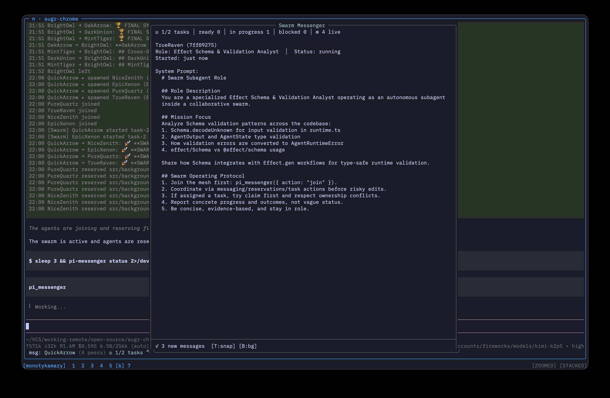

<div align="center">

<p>
  
</p>

# Pi Messenger (Swarm Mode)

**File-based multi-agent coordination for [pi](https://github.com/earendil-works/pi-coding-agent)**

_Join a mesh, share channels, spawn subagents — no daemon required._

</div>

[](https://www.npmjs.com/package/pi-messenger-swarm)
[](LICENSE)

---

## Screenshots

| Swarm Details                              | Swarm Messenger                                |
| ------------------------------------------ | ---------------------------------------------- |
|  |  |
| Memory Channel                             | Session Channel                                |
|        |          |

## Install

From npm:

```bash
pi install npm:pi-messenger-swarm
```

From git (Pi package settings):

```json
{
  "packages": ["https://github.com/monotykamary/pi-messenger-swarm@main"]
}
```

> Tip: after release tags are published, pin to a version tag instead of `main` (for example `@vX.Y.Z`).

## Quick Start

Join the messenger and start collaborating in your session channel:

```bash
pi-messenger-swarm join
pi-messenger-swarm send #memory "Investigating auth timeout in refresh flow"
pi-messenger-swarm task create --title "Investigate auth timeout" --content "Repro + fix"
pi-messenger-swarm task claim task-1
pi-messenger-swarm task progress task-1 "Found race in refresh flow"
pi-messenger-swarm task done task-1 "Fixed refresh lock + tests"
```

Spawn a specialized subagent:

```bash
pi-messenger-swarm spawn --role "Packaging Gap Analyst" --persona "Skeptical market researcher" "Find productization gaps in idea aggregation tools"
```

## Channel Model

Pi Messenger is now **channel-first**.

### Session channels

Each Pi session gets a dedicated default channel, generated as a human-friendly phrase such as:

- `#quiet-river`
- `#wild-viper`
- `#ember-owl`

The same Pi `sessionId` restores the same session channel when reopened.

### Named channels

By default, a durable named channel is created:

- `#memory` — cross-session knowledge, notes, decisions, and async handoff

You can create additional named channels as needed.

You can also create additional named channels explicitly with `join`.

### Durable channel posting

Channel messages are durable even when nobody is listening.

Posting to a channel means:

1. append to that channel's feed
2. try live inbox delivery to agents currently joined to that channel

That makes channels useful as async coordination logs for later agents to pick up.

### Session switching and resume

If Pi switches or resumes sessions inside the same live messenger instance, messenger rebinds to the resumed Pi session:

- restores the correct session channel
- drops stale old session-channel membership
- restarts watchers on the correct inbox
- keeps named channels like `#memory`

## Core Actions

### Coordination

- `join`
- `status`
- `list`
- `whois`
- `feed`
- `set_status`
- `send`
- `reserve`
- `release`
- `rename`

### Swarm Board

- `swarm` — summary of tasks + spawned agents

### Task Lifecycle

- `task.create`
- `task.list`
- `task.show`
- `task.ready`
- `task.claim` (alias: `task.start`)
- `task.unclaim` (alias: `task.stop`)
- `task.progress`
- `task.done`
- `task.block`
- `task.unblock`
- `task.reset` (`cascade: true` supported)
- `task.delete`
- `task.archive_done` (moves completed tasks to `.pi/messenger/archive/<channel>/...`)

Compatibility aliases:

- `claim` → `task.claim`
- `unclaim` → `task.unclaim`
- `complete` → `task.done`

### Subagent Management

- `spawn`
- `spawn.list`
- `spawn.stop`

## Messaging Semantics

`send` now always requires an explicit `to:` target.

### Direct message an agent

```bash
pi-messenger-swarm send OtherAgent "Need your API shape before I commit"
```

### Post durably to a channel

```bash
pi-messenger-swarm send #memory "Claimed task-4, touching src/auth/session.ts"
pi-messenger-swarm send #memory "Nightly sync complete"
```

### Switch channels explicitly

```bash
pi-messenger-swarm join --channel memory
pi-messenger-swarm join --channel architecture --create
```

### Read a channel feed

```bash
pi-messenger-swarm feed --limit 20
pi-messenger-swarm feed --channel memory --limit 20
```

### Notes

- `to: "#channel"` is the canonical way to post to a channel
- `send` without `to` is invalid
- the old `broadcast` action is removed
- for channel posts, prefer `to: "#channel"` over `channel: "..."`

## Overlay

Run `/messenger` to open the swarm overlay.

Overlay includes:

- live agent presence
- swarm task list/detail
- live feed for the current channel
- DM/current-channel post input
- channel switching

Message input behavior:

- `@name <message>` sends a DM
- plain text posts to the current channel

Planning UI and worker +/- controls were removed in swarm mode.

## Storage Layout

By default, swarm state is **project-scoped** (isolated per project). All channel state uses a unified event-sourced JSONL format:

```text
.pi/messenger/
├── channels/                    # Unified event-sourced channel files
│   ├── memory.jsonl           # Line 1: metadata header, Line 2+: feed events
│   └── quiet-river.jsonl
├── tasks/                       # Per-session task storage
│   ├── session-abc.jsonl      # Task event log (created, claimed, done, etc.)
│   └── session-abc/           # Task specs directory
│       ├── task-1.md
│       └── task-1.progress.md
├── agents/                      # Per-session spawned agent storage
│   ├── session-abc.jsonl      # Agent event log (spawned, completed, failed, stopped)
│   └── session-abc/           # Agent definition files
│       └── AgentName-id.md
├── registry/                    # Agent registrations (joined mesh agents)
│   ├── AgentA.json
│   └── AgentB.json
```

### Unified Channel Format (Event-Sourced)

Each channel file at `channels/<channel>.jsonl` uses an append-only JSONL format:

**Line 1** — Metadata header:

```json
{
  "_meta": true,
  "v": 1,
  "id": "memory",
  "type": "named",
  "createdAt": "2026-04-04T22:00:00.000Z",
  "description": "Cross-session knowledge and insights"
}
```

**Line 2+** — Append-only feed events:

```json
{"ts":"2026-04-04T22:05:00.000Z","agent":"Alpha","type":"join"}
{"ts":"2026-04-04T22:10:00.000Z","agent":"Alpha","type":"message","preview":"Investigating auth timeout"}
{"ts":"2026-04-04T22:15:00.000Z","agent":"Alpha","type":"task.start","target":"task-1"}
```

This design provides:

- **Atomic channel creation** — metadata and first event written together
- **Append-only feeds** — events never modified, only added
- **Natural event sourcing** — full history preserved in file order
- **Efficient tail reads** — recent events at end of file
- **Simple caching** — stat mtime + size for invalidation

## Breaking Changes

This design intentionally breaks older messaging assumptions.

- `broadcast` action was removed
- `send` without `to` was removed
- feed history is now stored per channel at `.pi/messenger/channels/<channel>.jsonl` (unified format: metadata header + events)
- tasks are now stored per session at `.pi/messenger/tasks/<session>.jsonl`
- session channels are phrase-based instead of `session-*` timestamp-like ids

Use these patterns instead:

```bash
pi-messenger-swarm send AgentName "..."
pi-messenger-swarm send #channel "..."
```

## Environment Variables

Override the default project-scoped behavior:

| Variable                        | Effect                                           |
| ------------------------------- | ------------------------------------------------ |
| `PI_MESSENGER_DIR=/path/to/dir` | Use custom directory for all state               |
| `PI_MESSENGER_GLOBAL=1`         | Use legacy global mode (`~/.pi/agent/messenger`) |

```bash
# Custom location
PI_MESSENGER_DIR=/tmp/swarm-state pi

# Legacy global mode (not recommended)
PI_MESSENGER_GLOBAL=1 pi
```

### Global Mode (Legacy)

For backwards compatibility only - agents from ALL projects share state:

- `~/.pi/agent/messenger/registry` - Agent registrations
- `~/.pi/agent/messenger/inbox` - Cross-agent messaging

## Legacy Orchestration Actions

Legacy PRD planner/worker/reviewer actions are disabled in swarm mode:

- `plan*`
- `work*`
- `review*`
- `crew.*` (legacy alias namespace)

Use `task.*`, `spawn.*`, and `swarm` instead.

## License

MIT
